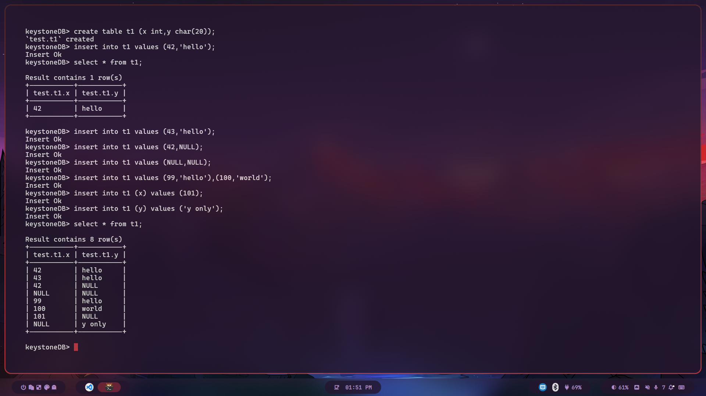

# keystoneDB
Database Management Systems Laboratory(CS39202) Term Project


## Project Demo


## Build

### Ubuntu 22.04

To get the third party dependencies(via source code), run:

```shell
git submodule init
git submodule update
```

Install the following libraries on your computer
Ubuntu
```shell
# required by rocksdb
sudo apt-get install libgflags-dev libzstd-dev libsnappy-dev zlib1g-dev libbz2-dev liblz4-dev
# required by protobuf
sudo apt-get install libprotobuf-dev protobuf-compiler
# required by flex and bison
sudo apt-get install flex bison

```
### Arch Linux
```shell
# Required by RocksDB
sudo pacman -S gflags zstd snappy zlib bzip2 lz4 liburing-dev

# Required by Protobuf
sudo pacman -S protobuf

# Required by flex and bison
sudo pacman -S flex bison

```
If on compiling the GRPC library gives error you need to recompile the [db.proto](./common/codec/db.proto)
with 
```shell
protoc --cpp_out=./ common/codec/db.proto
```
Then recompile the database again.

This code was tested on **Arch Linux**. 
If you are running on **Ubuntu** there can be an error that **abseil error** comes.
For this you need to comment the line **153 and 154** in the [CMakeLists.txt](./CMakeLists.txt).

## Features

* Expression evaluation(Nested)
* SQL comment
* `NOT NULL` column constraint
* Datatype: `INT`, `FLOAT`, `CHAR(N)`
* Multi-line support
* sql file execution
* Line editing and sql history
* Select multiple tables
* Based on persistent key-value storage(built upon LSM-Tree)

## Supported SQL (Example)

```sql
CREATE DATABASE example;
USE example;
CREATE TABLE user (id int);
SHOW TABLES;
INSERT INTO user (id NOT NULL) VALUES (1);
SELECT id from user WHERE id = 42;
UPDATE user SET id=1 WHERE id=42;
DELETE FROM user WHERE id=42;
SELECT * from user where id=(1+2*2+(id=id)+id^id+id) AND id = id%2 AND id IS NOT NULL;
select * from t1  where id is not null;
DROP TABLE user;
exit; -- keyword used to exit from the database
```

More details in [test.sql](./test/test.sql):

```sql
use test;
select * from test.table1,table1;-- duplicated table (It is correctly checked)
```

## Build

```shell
mkdir build
cd build

cmake ..
make -j4
```

On building it the libfort library might gives an error with `cmake ..` commands due the libfort cmake version specified. IF you update the libfort Cmake Version then the code does not compile. A fix to that is  to run the command `cmake -DCMAKE_POLICY_VERSION_MINIMUM=3.5 ..`  in the build directory first then run `cmake ..` and then `make -j4`.

## Project Structure

| File                 | Description                                         |
|----------------------|-----------------------------------------------------|
| include/*            | all the header files                                |
| sql/*                | intermediate representation(IR) for SQL             |
| executor/*           | execute SQL IR                                      |
| executor/processor/* | processor for SQL expression(visitor pattern)       |
| parser/sql.l         | lexical analysis for SQL(flex)                      |
| parser/sql.y         | syntax analysis for SQL(bison)                      |
| third_party/*        | third party dependencies, e.g., googletest, rocksdb |
| test/*               | unit test                                           |
| docs/*               | documentation for the project                       |

## Run

Start keystoneDB interactive shell (interactive mode)

```shell
# Assuming you are in build directory
./build/keystoneDB
```
