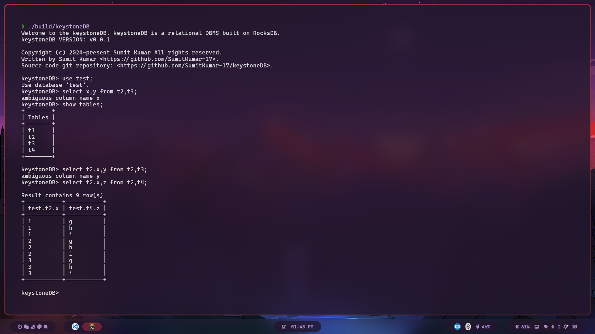

# keystoneDB


A relational DBMS built upon persistent key-value storage for Database Management Systems Laboratory (CS39202) Term Project

[](https://github.com/SumitKumar-17/keystoneDB)&nbsp;&nbsp;&nbsp;&nbsp;[](https://github.com/SumitKumar-17/keystoneDB/stargazers)


## Features

* Expression (nested) evaluation (including `+-*/%^`, `AND/OR`, `... BETWEEN ... AND ...`, `IS NULL`, `IS NOT NULL` on `CHAR` and `INTEGER`)
* SQL comment
* `NOT NULL` column constraint
* Supported Datatype: `INT`, `FLOAT`, `CHAR(N)`
* Multi-line support
* SQL file execution (`./keystoneDB --filepath="/path/to/example.sql"`)
* Line editing and SQL history
* Select multiple tables (a.k.a., Cartesian product)
* Based on persistent key-value storage (built upon LSM-Tree) like [MyRocks](http://myrocks.io/) and [TiDB](https://docs.pingcap.com/zh/tidb/stable)

## Build

### Ubuntu 22.04

To get the third party dependencies (via source code), run:

```shell
git submodule init
git submodule update
```

Install the following libraries on your computer:

```shell
# required by rocksdb
sudo apt-get install libgflags-dev libzstd-dev libsnappy-dev zlib1g-dev libbz2-dev liblz4-dev
# required by protobuf
sudo apt-get install libprotobuf-dev protobuf-compiler
# required by flex and bison
sudo apt-get install flex bison
```

### Arch Linux

```shell
# Required by RocksDB
sudo pacman -S gflags zstd snappy zlib bzip2 lz4 liburing-dev

# Required by Protobuf
sudo pacman -S protobuf

# Required by flex and bison
sudo pacman -S flex bison
```

If compiling the GRPC library gives an error, you need to recompile the [db.proto](./common/codec/db.proto) with:

```shell
protoc --cpp_out=./ common/codec/db.proto
```

Then recompile the database again.

This code was tested on **Arch Linux**. 
If you are running on **Ubuntu** there can be an error that **abseil error** comes.
For this you need to comment the line **153 and 154** in the [CMakeLists.txt](./CMakeLists.txt).

### Building the Project

```shell
mkdir build
cd build
cmake ..
make -j4
```

## Supported SQL (Example)

```sql
CREATE DATABASE example;
USE example;
CREATE TABLE user (id int, score float);
SHOW TABLES;
INSERT INTO user (id int NOT NULL) VALUES (1);
SELECT id from user WHERE id = 42;
UPDATE user SET id=1 WHERE id=42;
DELETE FROM user WHERE id=42;
SELECT * from user where id=(1+2*2+(id=id)+id^id+id) AND id = id%2 AND id IS NOT NULL;
select * from t1 where id is not null;
DROP TABLE user;
exit; -- keyword used to exit from the database
```

More details in [test.sql](./test/test.sql):

```sql
use test;
select * from test.table1,table1;-- duplicated table (It is correctly checked)
```

## Project Structure

| File                 | Description                                         |
|----------------------|-----------------------------------------------------|
| include/*            | all the header files                                |
| sql/*                | intermediate representation(IR) for SQL             |
| executor/*           | execute SQL IR                                      |
| executor/processor/* | processor for SQL expression(visitor pattern)       |
| parser/sql.l         | lexical analysis for SQL(flex)                      |
| parser/sql.y         | syntax analysis for SQL(bison)                      |
| third_party/*        | third party dependencies, e.g., googletest, rocksdb |
| test/*               | unit test                                           |
| docs/*               | documentation for the project                       |

## Run

Start keystoneDB interactive shell (interactive mode):

```shell
# Assuming you are in build directory
./build/keystoneDB
```

## Architecture Images


## Demo Images





