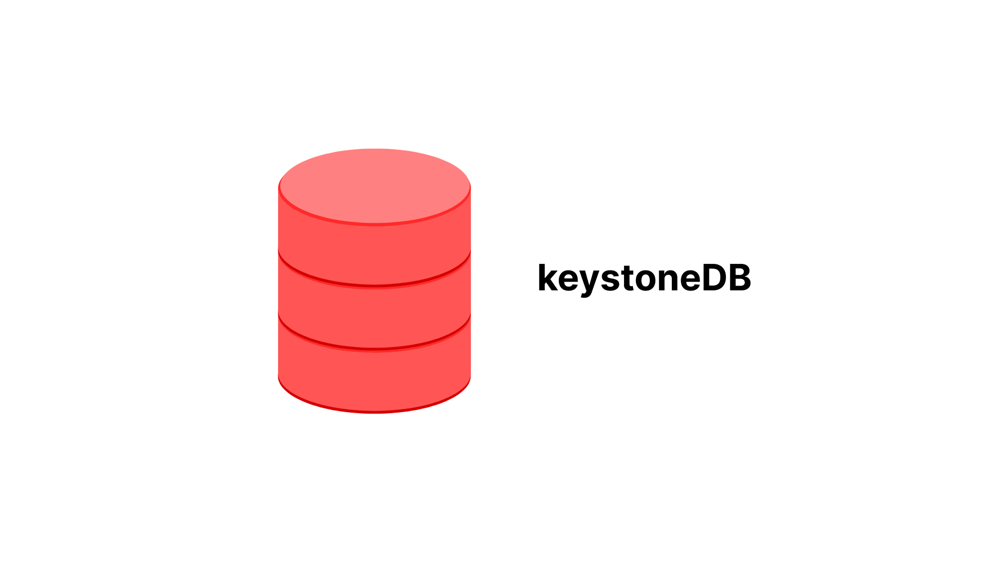

  

  <h1>keystoneDB</h1>
  
<strong>A relational DBMS built upon persistent key-value storage</strong>

  
<em>Database Management Systems Laboratory (CS39202) Term Project</em>

  
  

    
    
  

  

## Key Features

  

    <h3>Expression Evaluation</h3>
    
Support for nested expressions including arithmetic operations, logical operations, and more

  

  

    <h3>Multiple Data Types</h3>
    
Support for INT, FLOAT, and CHAR(N) data types

  

  

    <h3>Constraints</h3>
    
NOT NULL constraint, SQL comments, and more

  

  

    <h3>Multi-line Support</h3>
    
Execute multi-line SQL statements with ease

  

  

    <h3>File Execution</h3>
    
Run SQL scripts directly from files

  

  

    <h3>Persistent Storage</h3>
    
Built upon LSM-Tree like MyRocks and TiDB

  

## Build Instructions

  <button class="tablinks active" onclick="openTab(event, 'Ubuntu')">Ubuntu 22.04</button>
  <button class="tablinks" onclick="openTab(event, 'Arch')">Arch Linux</button>

  <h3>Ubuntu 22.04</h3>
  
  
To get the third party dependencies (via source code), run:

  
  

    <pre><code>git submodule init
git submodule update</code></pre>
    <button class="copy-button" onclick="copyCode(this)">Copy</button>
  

  
  
Install the following libraries on your computer:

  
  

    <pre><code># required by rocksdb
sudo apt-get install libgflags-dev libzstd-dev libsnappy-dev zlib1g-dev libbz2-dev liblz4-dev
# required by protobuf
sudo apt-get install libprotobuf-dev protobuf-compiler
# required by flex and bison
sudo apt-get install flex bison</code></pre>
    <button class="copy-button" onclick="copyCode(this)">Copy</button>
  

  <h3>Arch Linux</h3>
  
  

    <pre><code># Required by RocksDB
sudo pacman -S gflags zstd snappy zlib bzip2 lz4 liburing-dev

# Required by Protobuf
sudo pacman -S protobuf

# Required by flex and bison
sudo pacman -S flex bison</code></pre>
    <button class="copy-button" onclick="copyCode(this)">Copy</button>
  

  
  
If compiling the GRPC library gives an error, you need to recompile the db.proto with:

  
  

    <pre><code>protoc --cpp_out=./ common/codec/db.proto</code></pre>
    <button class="copy-button" onclick="copyCode(this)">Copy</button>
  

  
<strong>Note:</strong> This code was tested on <strong>Arch Linux</strong>. 
  If you are running on <strong>Ubuntu</strong> there can be an error related to <strong>abseil</strong>.
  If you encounter this error, you need to comment lines <strong>153 and 154</strong> in the CMakeLists.txt file.

### Building the Project

  <pre><code>mkdir build
cd build
cmake ..
make -j4</code></pre>
  <button class="copy-button" onclick="copyCode(this)">Copy</button>

## Supported SQL Examples

  <pre><code>CREATE DATABASE example;
USE example;
CREATE TABLE user (id int, score float);
SHOW TABLES;
INSERT INTO user (id int NOT NULL) VALUES (1);
SELECT id from user WHERE id = 42;
UPDATE user SET id=1 WHERE id=42;
DELETE FROM user WHERE id=42;
SELECT * from user where id=(1+2*2+(id=id)+id^id+id) AND id = id%2 AND id IS NOT NULL;
select * from t1 where id is not null;
DROP TABLE user;
exit; -- keyword used to exit from the database</code></pre>
  <button class="copy-button" onclick="copyCode(this)">Copy</button>

Additional examples can be found in [test.sql](https://github.com/SumitKumar-17/keystoneDB/blob/main/test/test.sql).

## Project Structure

| File                 | Description                                         |
|----------------------|-----------------------------------------------------|
| include/*            | all the header files                                |
| sql/*                | intermediate representation(IR) for SQL             |
| executor/*           | execute SQL IR                                      |
| executor/processor/* | processor for SQL expression(visitor pattern)       |
| parser/sql.l         | lexical analysis for SQL(flex)                      |
| parser/sql.y         | syntax analysis for SQL(bison)                      |
| third_party/*        | third party dependencies, e.g., googletest, rocksdb |
| test/*               | unit test                                           |
| docs/*               | documentation for the project                       |

## How to Run

  <pre><code># Assuming you are in build directory
./build/keystoneDB</code></pre>
  <button class="copy-button" onclick="copyCode(this)">Copy</button>

## Architecture

  
    

      
    

  

  &times;
  

## Demo Screenshots

  
    

      
    

  

